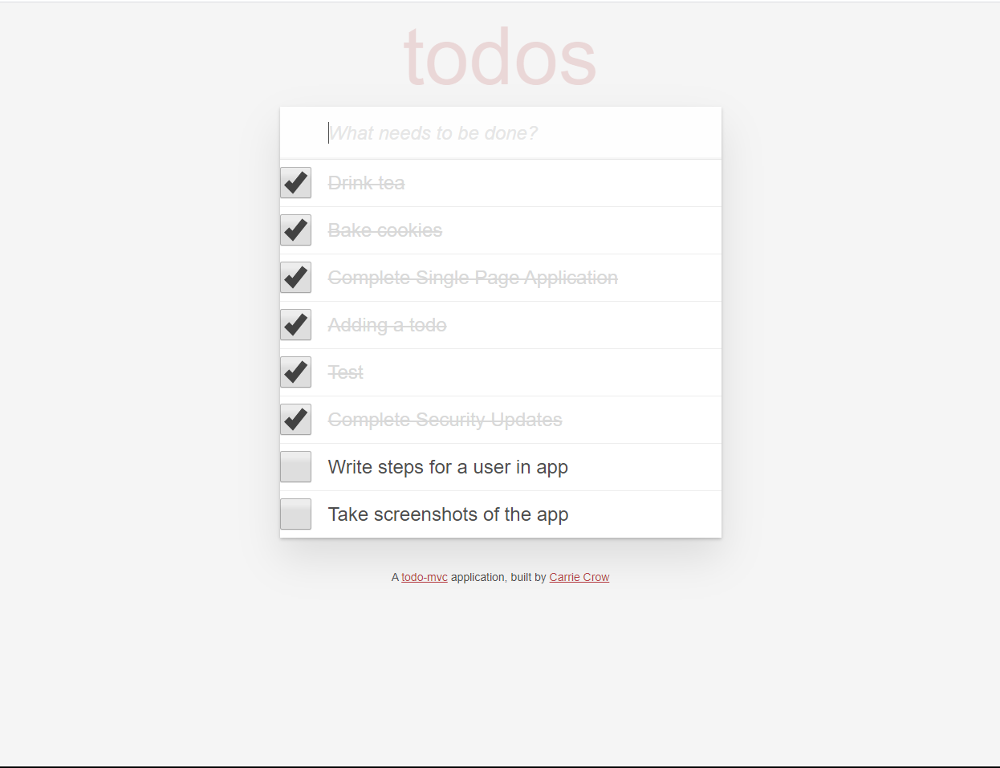

# ToDoster

ToDoster is a single page application designed using JavaScript and todo-mvc in order to manage a user's tasks on a single page.

This application was created as part of the University of Wisconsin Extension Bootcamp.pplication up and running.

## User Stories
As user, I want to:
* See a list of all tasks I have entered, so that I may decide which to do next.
* See which tasks are complete, so I can track progress..
* Add new tasks to the list, so I can know anything new that needs to be done.
* Mark tasks as complete, so I can avoid duplicate work.

## How to run the application:
Automated unit tests are available to run on your local environment. Enter "bundle exec rspec" into the command line.

### Production
Navigate to the production location of [ToDoSter](https://todoster-carrie-crow.herokuapp.com/)
1. From the home page, you are presented a full list of tasks already entered:

2. To add a task, enter the task into the text box at the top of the screen and press enter.
3. To mark a task as complete, click inside the square box next to it.
4. If needed, you can mark a complete task as still to do by clicking on the check mark as well.

## High Level Organization
ToDoster uses the todo-mvc library to adding and removing tasks from the PostGreSQL database. 

### Application Specs
ToDoster is a Ruby on Rails application, with a database is managed by PostgreSQL
* Rails v. 5.2.3
* Ruby v. 2.5.3